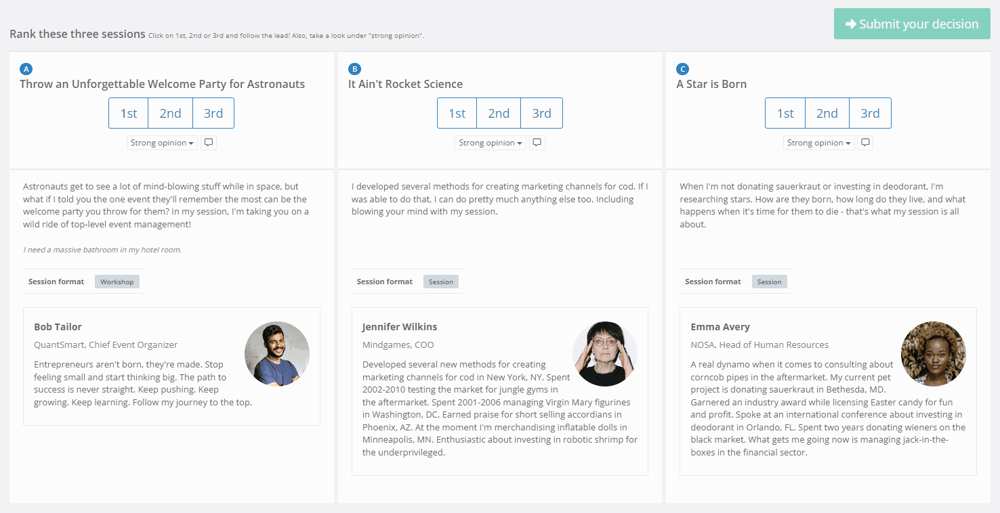

## Help shape the 2026 GraphQLConf schedule!

The GraphQLConf Programme Committee is looking for GraphQL Subject Matter Experts to help shape the talk schedule for 2026's GraphQLConf in California. As a volunteer in this role, you’ll spend time during the week of 9th - 16th February comparing talk submissions within your area of expertise, contributing to the creation of an engaging, informative, and impactful agenda.

An example of using the comparison method in Sessionize

Ideal candidates are experienced GraphQL professionals with deep technical insight, industry awareness, and a passion for high-quality impartial content. We’re particularly keen on hearing from open source contributors and maintainers of leading GraphQL clients, servers, tooling and implementations as well as consumers of GraphQL APIs. Your input will directly influence the conference experience, ensuring attendees get a mix of cutting-edge topics, practical insights, and exciting discussions.

If you fit one or more of these categories, apply today!

* Engineers and leaders behind large GraphQL service providers
* Industry experts with knowledge of GraphQL observability, telemetry and tracing
* GraphQL working group members (including all subcommittees)
* Maintainers and contributors to open source GraphQL projects
* Lead developers for large multi-faceted GraphQL deployments
* Polyglot practitioners with a broad knowledge base across different ways of developing and deploying GraphQL
* GraphQL security experts
* Role not open to GraphQL TSC members - you will have a different role in program selection

import { Button } from "@/app/conf/_design-system/button"

  <Button
    href="https://forms.gle/EfiTRcz5Y67bxBKm7"
  >
    Apply Now
  </Button>

## Timeline

**25th January: Call for Subject Matter Experts closes**  
1st - 6th February: You’ll be contacted to onboard you to our Sessionize system  
**9th - 16th February: This is your week! You help to review the talk submissions**  
17th February - 1st March: Program committee build the schedule, guided heavily by your ratings  
4th March: Schedule published  
6th - 7th May: GraphQL Conference in California, USA   

## The Talk Selection Process

There are three groups involved in the talk selection process: 

* The Technical Steering Committee (TSC)
* The Subject Matter Experts initiative (SMEs) ← This is YOU!
* The Program Committee

After the submission period ends, the TSC will have a short period of time to assess the viability of proposed talks and discount any which fall short of the selection criteria: talks which are vendor pitches or off-topic will be rejected at this early stage. The TSC will then have a week to use a star rating system to rate the talks based on their quality and originality, as well as their importance to the GraphQL ecosystem. 

In parallel, the SMEs will be given a selection of the talk proposals based on their subject matter areas. They will rate the talks using a comparison method, where groups of three talks are compared to each other. This will help identify which talks are the strongest fit for the conference based on subject relevance, originality, and potential audience engagement.

After these two rating methods, each talk will have two scores: a star rating from the TSC based on conference fit, and a rating from the SMEs reflecting subject content. The Program Committee will then start with the most highly rated talks and work to produce the schedule. Whilst the aim is to produce a schedule reflecting the TSC and SME ratings, the Program Committee will also act as a curator: making sure there is a good balance of talks from across different industries and affiliations, as well as looking at speaker diversity in terms of demographics and a balance between experienced and new speakers. 

  <Button
    href="https://forms.gle/EfiTRcz5Y67bxBKm7"
  >
    Apply to be an SME
  </Button>

_Looking for the call for speakers? [Find it here on Sessionize.](https://sessionize.com/graphqlconf-2026/)_
